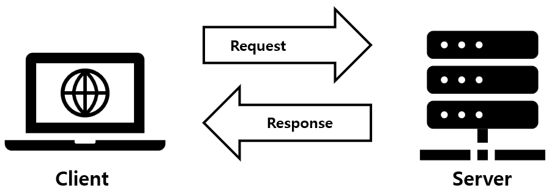

# 01장. 자바 백엔드 개발자가 알아두면 좋은 지식

## Table of contents

1. [서버와 클라이언트](#11-서버와-클라이언트)
2. [데이터베이스](#12-데이터베이스)
3. [아이피와 포트](#13-아이피와-포트)
4. [라이브러리와 프레임워크](#14-라이브러리와-프레임워크)
5. [백엔드 개발자의 업무](#15-백엔드-개발자의-업무)
6. [백엔드 프로그래밍 언어](#16-백엔드-프로그래밍-언어)
7. [자바 애너테이션](#17-자바-애너테이션)

 

## 1.1 서버와 클라이언트

 

### 1.1.1 클라이언트란?

클라이언트는 서버로 요청하는 프로그램을 모두 일컬어 말한다.
ex) 웹 브라우저

 

### 1.1.2 서버란?

서버는 클라이언트의 요청을 받아 처리하는 주체이다.

 

 

## 1.2 데이터베이스

데이터베이스는 여러 사람이 데이터를 한 군데에 모아놓고 여러 사람이 사용할 목적으로 관리하는 데이터 저장소이다.

MySQL, Oracle, PostgreSQL는 데이터베이스를 관리하기 위한 시스템이다.

 

### 1.2.1 RDB란?

관계형 데이터베이스는 데이터를 행(row)과 열(column)로 이루어진 테이블로 관리하며, 기본 키(Primary key)를 사용해 각 행을 식별합니다.

 

### 1.2.2 SQL이란?

SQL은 Structured Query Language의 약자로 말그래도 쿼리, 즉, 데이터 검색을 하는 언어입니다.

 

### 1.2.3 NoSQL이란?

NoSQL의 뜻이 SQL을 안 쓴다는 의미로 사용되기도 합니다만, 최근에는 Not Only SQL의 의미로 많이 사용합니다. NoSQL은 대량의 분산 데이터 처리와 확장성을 지원하는 목적으로 개발된 데이터베이스 시스템입니다.

 

 

## 1.3 아이피와 포트

아이피(IP)는 인터넷에서 컴퓨터 또는 기기들이 서로를 식별하고 통신하기 위한 주소입니다. 아이피가 서버를 찾기 위한 번호라면 포트는 그 서버에서 운용되고 있는 서비스를 구분하기 위한 번호입니다.

 

 

## 1.4 라이브러리와 프레임워크

### 1.4.1 라이브러리란?

라이브러리(library)는 애플리케이션 개발에 필요한 기능인 클래스, 함수 등을 모아놓은 코드의 모음을 말합니다. 라이브러리는 독립적이므로 라이브러리끼리 영향을 크게 주지 않습니다.

 

### 1.4.2 프레임워크란?

프레임워크(framework)는 소프트웨어 개발을 수월하게 하기 위한 소프트웨어 개발 환경입니다. 프레임워크는 일하기 위한 틀을 제공하는 것이다. 프레임워크는 정해진 틀에서 개발해야 한다는 단점이 있지만 개발 효율은 굉장히 높다는 장점이 있습니다.

 

### 1.4.3 라이브러리 vs 프레임워크

라이브러리는 개발을 하는 과정에서 필요한 기능을 구현하기 위해 사용한다. 

프레임워크는 애플리케이션을 개발할 때 전체적인 구조를 잡기 위해 사용한다.

 

 

## 1.5 백엔드 개발자의 업무

백엔드 개발자의 주된 업무는 서버 측 애플리케이션을 개발하는 일이빈다. 개발하면서 서버에 대한 지식과 프로그래밍 지식, 만든 프로그램을 배포하고 안전하게 서비스할 수 있게 하는 지식을 활용합니다.

 

 

## 1.6 백엔드 프로그래밍 언어

백엔드에서 많이 사용하는 언어는 파이썬, C++, 자바, C#, 자바스크립트입니다.

 

 

## 1.7 자바 애너테이션

자바 애너테이션(java annotation)은 자바로 작성한 코드에 추가하는 표식을 말합니다. 보통 애너테이션은 @기호를 사용하며 JDK 1.5버전부터 사용할 수 있습니다.